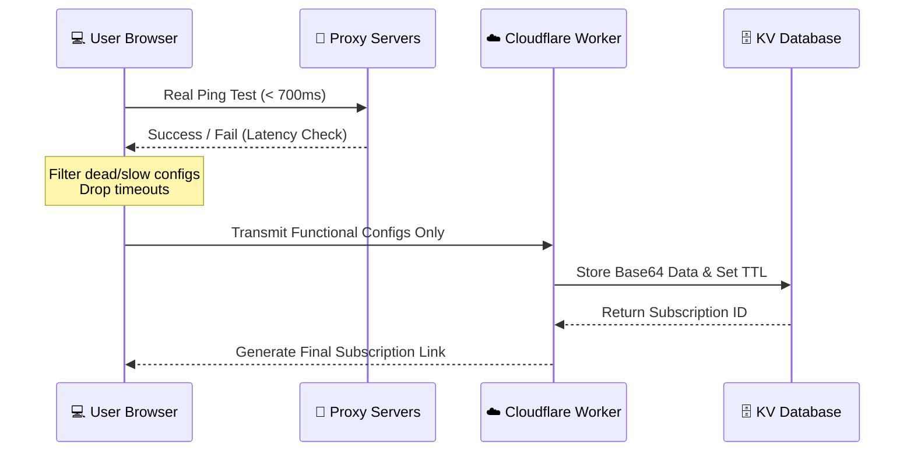

# JPL Subscription Processor
---

🌐 **Live Demo:** [https://amirhosseinjpl.github.io/Jpl-sub-processor/](https://amirhosseinjpl.github.io/Jpl-sub-processor/)

**Jpl-sub-processor** is a serverless application designed to process, test, filter, and host proxy configurations (VLESS, VMESS, Trojan, etc.) directly on Cloudflare Workers. 

By running latency checks directly on the client side before generating subscription links, this system ensures that only healthy, high-speed proxies are retained in your final configurations.

📊 **Project Features & Capabilities**

| Feature | Description |
|---------|-------------|
| **Supported Protocols** | VLESS, VMESS, Trojan, etc. |
| **Testing Architecture** | Client-side (Real Ping Test < 700ms) |
| **Storage Engine** | Cloudflare KV Database |
| **IP Replacement** | Custom IPs or CDN ranges (Cloudflare, Gcore, Fastly) |
| **Subscription Link** | Base64 encoded with customizable TTL (Expiration) |

---

## 🌐 Core Logic: Why Client-Side Testing?

In restrictive network environments, server-side testing (e.g., a Cloudflare Worker pinging a proxy server) often yields inaccurate results due to IP blocking. Furthermore, if users access the domain through an active VPN, a server-side ping would reflect the VPN's latency rather than their true, direct connection speed.

**Jpl-sub-processor** solves this by running the latency test entirely in the **user's browser**. It evaluates the configurations using the real, direct network connection. Any configuration with a response time over 700ms (or a timeout) is instantly dropped. Only verified, functional configurations are sent to the Worker to generate the final link.

## 📐 Architecture Diagram

---

## 🧑‍💻 Setup and Getting Started

### Section 1: ☁️ Cloudflare Worker Deployment

**Step 1.1: Create the Worker**
1. Log in to your Cloudflare Dashboard.
2. Go to **Workers & Pages** -> **Overview**.
3. Click **Create Application** and then **Create Worker**.
4. Name your worker (e.g., `jpl-sub-processor`) and click **Deploy**.
5. Click **Edit Code**, paste the backend code of this project, and click **Save and Deploy**.

### Section 2: 🗄️ KV Database Configuration

**Step 2.1: Create and Bind KV Namespace**
1. In the Cloudflare Dashboard, navigate to **Storage & Databases** -> **KV**.
2. Click **Create a namespace** (e.g., `JPL_KV_STORE`).
3. Go back to your Worker -> **Settings** -> **Variables & Secrets**.
4. Under **KV Namespace Bindings**, click **Add binding**.
5. Set the **Variable name** to exactly `JPL_KV`.
6. Select the namespace you created in step 2, then **Deploy**.

### Section 3: 🖥️ Frontend & UI Deployment (Bypass Restrictions)

If `workers.dev` domains are restricted or blocked in your network, you can separate the frontend from the backend. 

💡 **For easier access, we have already deployed a ready-to-use frontend for you!** You don't need to host it yourself. Simply visit the link below, input your Worker URL, and start processing:
👉 **[Jpl-sub-processor Web Interface](https://amirhosseinjpl.github.io/Jpl-sub-processor/)**

*If you prefer to host it yourself manually:*
1. Host the `index.html` file on independent platforms like **GitHub Pages**, **Vercel**, or **Netlify**.
2. Open your `index.html` file.
3. Locate the `WORKER_URL` variable inside the script and update it to your deployed Cloudflare Worker address:
   `const WORKER_URL = "https://your-worker-name.your-subdomain.workers.dev";`

---

## ✨ Key Features and Advantages

* **Client-Side Latency Testing:** ⚡ Filters out dead or slow configurations (> 700ms) based on real user network conditions.
* **Protocol Filtering:** 🎛️ Selectively keep only the protocols you actually need (e.g., isolate VLESS from a mixed list).
* **Dynamic IP Replacement:** 🔄 Swap configuration IPs with custom addresses or predefined CDN ranges (Cloudflare, Gcore, Fastly).
* **Automated Renaming:** 🏷️ Apply custom prefixes to your output configurations dynamically.
* **Subscription Expiration (TTL):** ⏳ Set expiration times for generated links to maintain a clean database and control access.

## 📄 License
This project is open-source and available under the MIT License.
